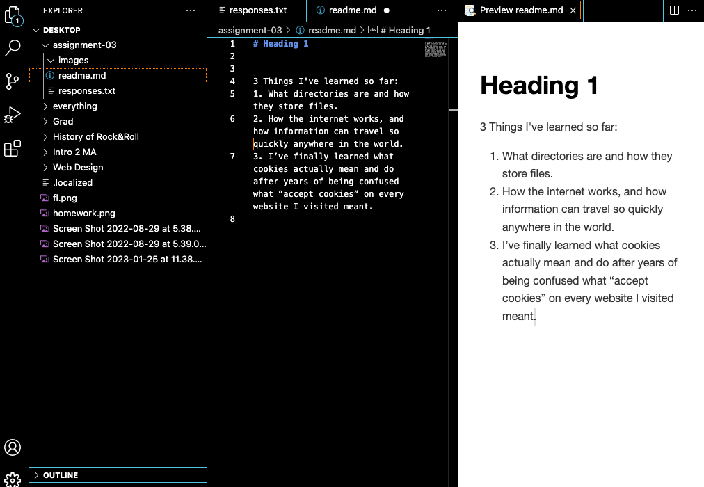

# Heading 1

3 Things I've learned so far:
1. What directories are and how they store files.
2. How the internet works, and  how information can travel so quickly anywhere in the world using fiberoptic cables. Also how fragile the internet really is.
3. Finally learned what cookies actually mean and do after years of being confused what “accept cookies” on every website I visited meant.

[MyFile](./responses.txt)

