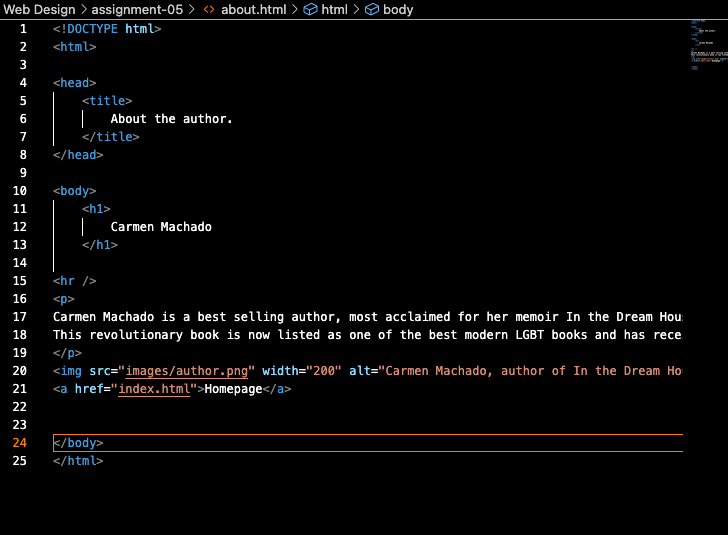

Q: Tell me about a website you visited using The Wayback Machine. What year was it from? How is the older version different from the new version in terms of its overall design?

A: I decided to look up how Nickelodeon's website used to look like in 2009 because I remember going on there all the time as a kid, just not how it used to look.
In terms of design difference, the older Nick looks a lot more like the format that newspaper organizations today, links to articles on the right hand side, bigger images with luring article names at the bottom, etc. It's for the most part plain but also simple to use. The modern Nick has similar attributes such as a slidebar at the top to direct you to certain show's hompages, but the designs are a lot more simplified and also colorful. It no longer is 60% walls of text.

