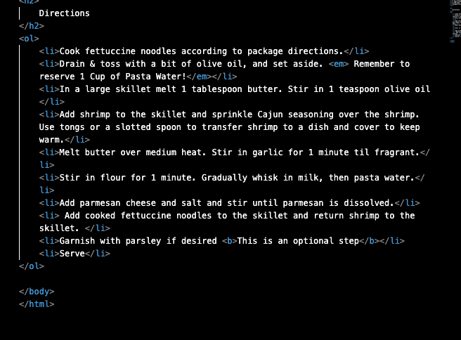

Q: Describe the difference between semantic and structural markup.
A:  Stuctural markups are visual guides that outline a page's setup with things such as headers and paragraphs is not directly seen on the page. 
Semantic markup is something visible to anyone visiting the website, and is used to enhance the meaning of text for the website by using things such as emphasis, quotes, etc.

