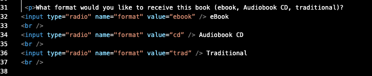

Q: Describe any forms you've come across while browsing the web. What purposes do they serve?
A: There are all types of forms that I've come across while using the web. I'd say the one I see and use the most is the "Unsubscribe" functions from emails. They utilize text for your email, buttons for reasons for leaving and/or choosing which types of emails to unsubscribe from (marketing, deals, all), etc.

