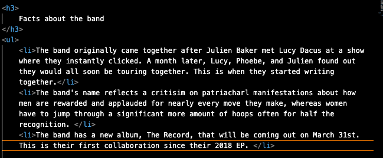

Q: Briefly recap your experience learning HTML. What was old, new, interesting, or difficult to learn?

A: Everything was new to me, however I felt after doing something once or twice it started to come easily to me. The only challenge I had and still face is more of styling issues. This includes things like centering images, spacing, and overall just having things be located where I want them to be.

Q: After we come back from spring break we will start to dive into CSS and expand on styling, which helps us "decorate" HTML. Is there anything you're anxious or excited to learn about in this new section?

A: I'm definitely anxious about this because styling has been the main issues for me so far and CSS as a whole concept is a bit daunting. However, I will be glad by the end that I learned such skills.

