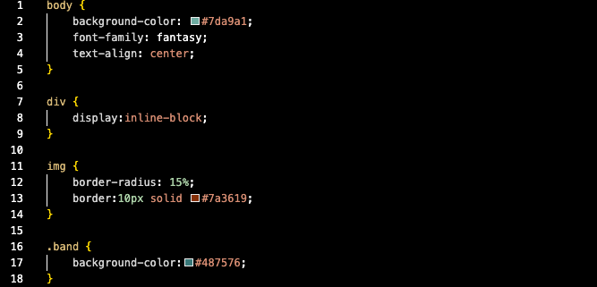

Q: Describe the difference between the universal, element, class, and id selector types. When might you choose one over the other to style content?
A:
universal= Styles -everything- on the page.
element= Select styles certain elements on a page (all h1s, h2s, etc.)
class= Selecting a specific element of the same function (ex: wanting to customize one h1 but not the other)
id selector= Select styles certain elements by using its specific assigned id.

Q: Discuss your color palette. How did you choose your colors?
A: I selected my colors by using an eyedropper tool on different areas of the image of the band.

