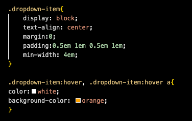

What is the difference between padding, margin, and borders?
The difference is what exactly the space it is between.

Padding is the space between the inner element and the element itself.
Margins are on the edge of the parent elements.
Borders are for the perimeter of the area. Define amount a space an element takes up.

How did this week's assignment go? What challenges did you face, and how did you overcome them?
It was really stressful to me. I feel like I can do the basics but then there is still issues for me when it comes to centering. Gettin stuff in the place I want it is hard for me to grasp a bit still. 

