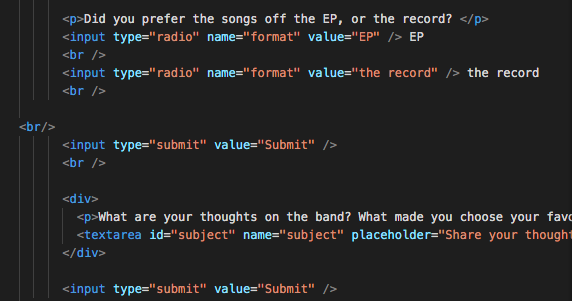

How did your user testing sessions go?
They went well, they were able to navigate to every page as needed/wanted.

What changes (if any) did you make to your website based on the user feedback you received?
Tried to change the second album's background color to match it, so each page that is an album matches the rest of the material.

